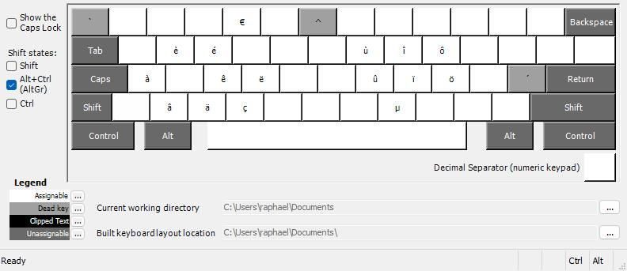

# Philosophie
Layout se voulant le plus proche possible du layout FR variante US de xkb disponible sous linux, voici les spécificités :
 
- `AltGr` + `e` = `é`
- `AltGr` + `w` = `è`
- `AltGr` + `d` = `ê`
- `AltGr` + `f` = `ë`

- `AltGr` + `a` = `à`
- `AltGr` + `s` = ``
- `AltGr` + `a` = `à`

- `AltGr` + `u` = `ù`
- `AltGr` + `j` = `û`

- `AltGr` + `i` = `î`
- `AltGr` + `k` = `ï`

- `AltGr` + `o` = `ô`
- `AltGr` + `l` = `ö`

- `AltGr` + `m` = `µ`

# Différences avec xkb FR US
Sous windows certains raccourci sont hardcodés et non remplaçables, c'est le cas pour ces raccourcis:

- `AltGr` + `r` => AltGr` + `w`

# Touches mortes
Les touches mortes sont accessiblent en utilisant `AltGr` / `AltGr + Shift`:

# Credits
Forkée de [qwaccent](https://github.com/vaemendis/qwaccent)
Layout generated using [Microsoft Keyboard Layout Creator 1.4 ](https://www.microsoft.com/en-us/download/details.aspx?id=102134).
